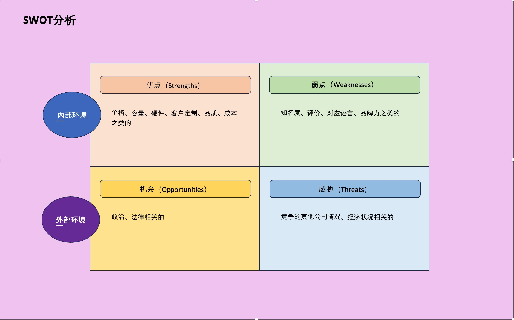

# 网页的目的、以及目标的确认

1、根据不同网页其对应的目的和目标也是不一样的

| 网页类型 | 目的 |
|-|-| 
| ECサイト | 商品销售 |
| リード獲得サイト | 潜在用户的收集（咨询、资料提供） |
| ポータルサイト | 广告收入 |
| サポートサイト | 提供现用户的一些服务，降低售后中心的成本 |
| コーポレート・ブランドサイト | 品牌价值的提升、建立客户忠诚度 |

2、目标：目标是为了达成目的、将其数值化的一个指标

例子：

| 区分 | 网页 |
|-|-| 
| 目的 | 提升客户的满足度 |
| 目标 | 取得忠诚客户10000名 |

3、确定了目标和目的后便落实如何去做，具体表现【谁】（具体的执行目标）、
【做什么】（具体执行内容）、【在那里传达】（媒体）、【结果想变成怎样】（达成的结果）

# 业务全体情况的掌握

从企业的历史、理念再到现状营业的状况、将来的发展方向等等要进行一个把握。
这样才能对网页的改善与有一个好的方向的确认。

## 活用市场营销框架

对于施策来说，可以使用市场那个营销框架来完成如何施策的分析

### 框架1：3C分析

<strong>整理分析自己和竞争者的优缺点，将对自己公司有利的情况找出来，随后进行经营策略。</strong>

### 框架2：SWOT分析

<strong>在市场营销中初期使用的分析，服务或者商品的优缺点、机遇、和危机进行分析，
罗列出特点和问题点、用于在新的企划和战略上</strong>

### 框架3：4P分析

<strong>又称呼为混合市场营销，有名的分类法。通过'4P'保证了品牌的一贯性来就行分析。</strong>
 Product(产品)：面向客户的需求能提供的价值是什么？
 Price(价格)：是否符合其价值
 Place(流通)：客户需要的时候就可以入手的流通优化是不是做到最好。
 Promotion(贩卖促进/广告宣传)：是否进行了适度的促销和广告来传达到客户那边。

### 框架4：STP分析

<strong>市场销售最代表的一个手法之一</strong>
 细分市场(Segmenting)- 根据特征和需求把客户细分成不同群体,明确目标客户。
 目标选择(Targeting)- 从细分后的群体中选择营销对象和目标客户。
 定位(Positioning)- 明确产品或服务在选择目标市场上的市场定位。

# 知道目标

整理目标->具体的执行目标【谁】：根据网站的目的来决定面向谁（目标）

## UX设计

为了提高对象的满意度，用户体验是很有必要的考虑

## ペルソナ（persona）設定

明确对象目标而使用的手法

基本上是用调查表的形式进行调查，不是那种30岁、女性、事物职位这种模糊的信息。而是具体的那种：
应该要更加具体一点，居住地、年收入、兴趣.....等等。

## 用户的行动变化

将目标的行动进行模型化（model）的方式分为AIDMA和AISAS两种方式，由于网络的普及现在主要是AISAS方式

同时是随着时代的发展AIDMA逐渐转型成为了AISAS方式

### AIDMA（アイドマ）

在90年代消费者从认知商品到购买商品动作的整一个心理流程

### AISAS（アイサス）

随着网络和社交媒体的发展和普及，作为现代消费者的行动模型AISAS模式便诞生了

## 交流的实际情况

### 概念1：全渠道（オムニチャネル）

オムニチャネル：客户在不管是线上还是线下，一直按照任何时机来入手商品的信息，同时随时也可以购买的活动

### 概念2：制作客户旅程地图（カスタマージャーニーマップ）

客户旅程地图是将客户从了解、购买到使用产品或服务的整个过程可视化映射出来。具体特点包括:
 在时间轴上可视化客户与品牌的各个接触点
 包含从品牌认知、购买、使用到售后等所有客户接触点
 明确显示每个步骤中客户的行为、想法和感受
 目的在于从客户视角分析旅程,发现改进点

客户旅程地图举例：

如果只是web的情况的话则是按照下面这个形式来表现：
 ①:从条形广告、PPC广告登入登陆页面
 ②:在电商网站里一边浏览一遍观看顺便下单
 ③:依据注册会员可以定期的收到活动以及特价的邮件，变成长期会员

#### 用在客户旅程地图的要素（カスタマージャーニーマップ）

##### 1、根据个人要求明确化一个目标

将最有客户代表的目标进行一个明确化，对客户的行动进行一个假设，以及成立一些问题和接触点。

##### 2、阶段

客户行动有很多阶段：找商品、决定商品、购买商品等等，然后企业把将各个阶段行动的服务与对应当作一个基本单位。

##### 3、接触点和客户行动

通常指的是企业与客户接触的点。在电商网站上买东西，
邮寄到家里面产品客户拿到时候，会附带一些感谢的纸质的东西，随后客户将其了解并且搜索。
随后会和朋友交谈以及在网上分享写评论等，达到了企业要求的客户的行动

##### 4、心里变化

在接触点这个方面，怎样的思考后并且进行了行动，客户的内心的变化是可以进行一个判定。
从对商品的认知到对其感兴趣、买入、成为会员的这样一个心理变化将其反应在客户旅程地图（カスタマージャーニーマップ）上，
便可以进行可视化，

# Web改善重点——KPI的设定

## 三个概念：KGI、CSF、KPI

| 用语 | 全称 | 含义|
|-|-|-|
| **KGI**  | KGI（Key Goal Indicator） **经营目标达成指标** | 应该达成目标的定量指标 例如：3年后营收达到5日元|
| **CSF**  | CSF（Critical Success Factor） **重要成功要因** | 为了达成目标，重点应该要做什么的要素 例如：增加客户数、提升单价 |
| **KPI**  | KPI（Key Performance Indicator） **重要业绩评价指标** | 为了检测目标达成的过程和实施情况、执行情况的定量的指标 例如：新客户获得100人，购入点数为100个 |

 KPI的设定手顺：目标-> KGI -> CSF -> KPI  

## 考虑サイトの目的

ECサイト的目的：贩卖商品将其销售额最大化

 
具体的流程： 
目标（KGI）->CSF->施策->KPI

## KGI的设定

确定一个具体的数值，基本上是由经营者和事业的责任者来决定。

举例：年度销售额达到7亿元

## CSF的设定

达到KGI需要如何做？提升电商网站的利润的原因是什么？
和经营者还有其他决策者进行讨论，设定多个CSF

举例： 
①来浏览的客户增加 
②让其客户的单价上升 
③增加回头客 

## 施策的考案

CSF决定了以后如何执行具体的实施，进行一个考虑。 
举例： 
①向横幅上增加广告 
②SEO对策 
③弄一些活动在社交媒体上进行发布 

### 决定施策的注意点

① **贡献度** = **影响度** ：进行实施后的成果是有哪些影响。 
② **实现性** 也是很重要的。 

